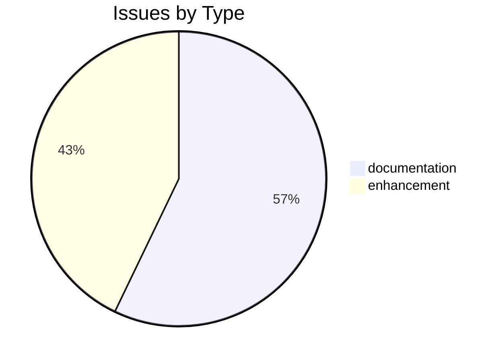
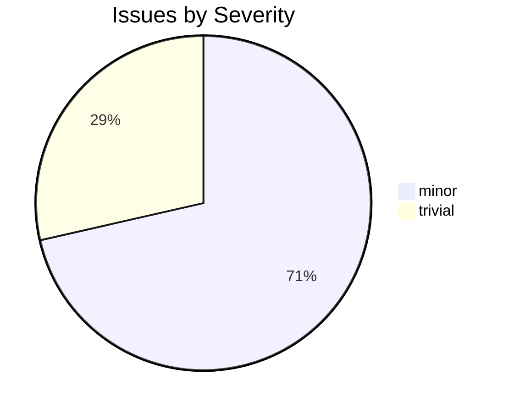

# csl-inflect

CDSL **processing-tool** repository in the Sanskrit Lexicon project.

## What it does

`csl-inflect` generates Sanskrit inflection tables — nominal declensions and verbal conjugations — from Monier-Williams (MW1899) dictionary data. It produces five SQLite databases used by the CDSL web interface to display paradigm tables alongside dictionary entries.

The tool is organized into three sub-pipelines:
- **nominals/** — identifies and declines Sanskrit nouns, adjectives, and indeclineables
- **verbs/** — generates conjugation tables for Sanskrit verb roots (4 special tenses currently)
- **sqlite/** — packages the output into queryable SQLite databases

All word forms use **SLP1** transliteration throughout.

## Quick usage

```bash
# Decline a nominal: model m_a (masculine a-stem), stem rAma
cd nominals/pysanskritv2/tables
python3 decline_one.py m_a rAma

# Conjugate a verb: class 1, active voice, present tense, root BU
cd verbs/pysanskritv2/tables
python3 conjugate_one.py 1,a,pre BU

# Rebuild all tables and SQLite databases
sh redo.sh
```

See [USAGE.md](USAGE.md) for full documentation.

## Related repositories

| Repository | Relationship |
|---|---|
| [funderburkjim/MWlexnorm](https://github.com/funderburkjim/MWlexnorm) | Primary input: MW headwords with gender and inflection data |
| [sanskrit-lexicon/csl-pywork](https://github.com/sanskrit-lexicon/csl-pywork) | Per-dictionary build scripts for other CDSL tools |
| [sanskrit-lexicon/csl-app](https://github.com/sanskrit-lexicon/csl-app) | CDSL web application that uses the SQLite databases produced here |
| [funderburkjim/elispsanskrit](https://github.com/funderburkjim/elispsanskrit) | Earlier Emacs Lisp implementation on which pysanskritv1 is based |

## Issues Overview

**Total**: 14 | **Open**: 11 | **Closed**: 3

### By Milestone

| Milestone | Open | Closed | Total |
|---|---|---|---|
| Unassigned | 11 | 3 | 14 |

### By Type



### By Severity



## GitHub Issue Conventions

Follows the [Cologne tooling-repo taxonomy](https://github.com/sanskrit-lexicon/csl-observatory/blob/main/runbook/cologne-tooling-runbook.md):

- **9 type labels**: bug, feature, enhancement, performance, tech-debt, security, documentation, infrastructure, question
- **4 severity levels**: trivial, minor, major, critical
- **5 milestones**: API Stability, User Experience, Data Quality, Developer Experience, Community
- **Org Project**: [Tooling Roadmap](https://github.com/orgs/sanskrit-lexicon/projects/9)

See [CLAUDE.md](CLAUDE.md) for full definitions.

---
*Generated by Cologne Tooling Runbook on 2026-05-15*
